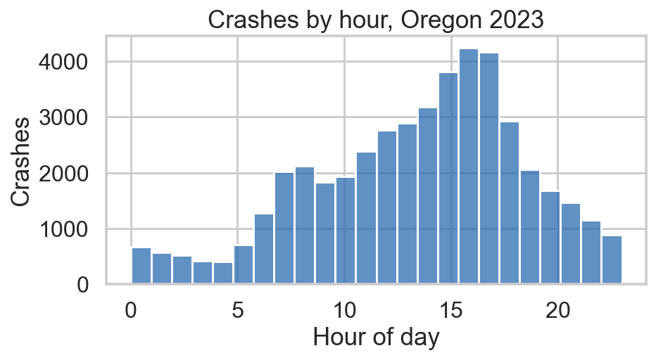
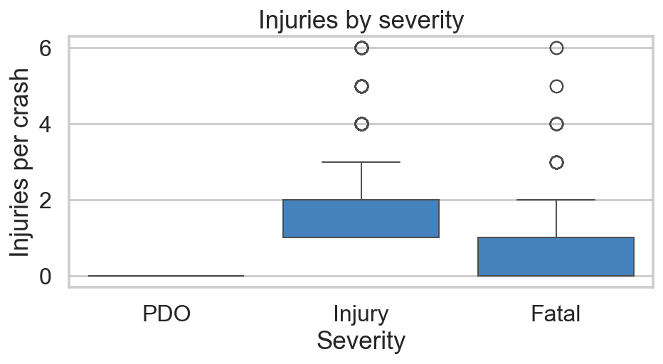
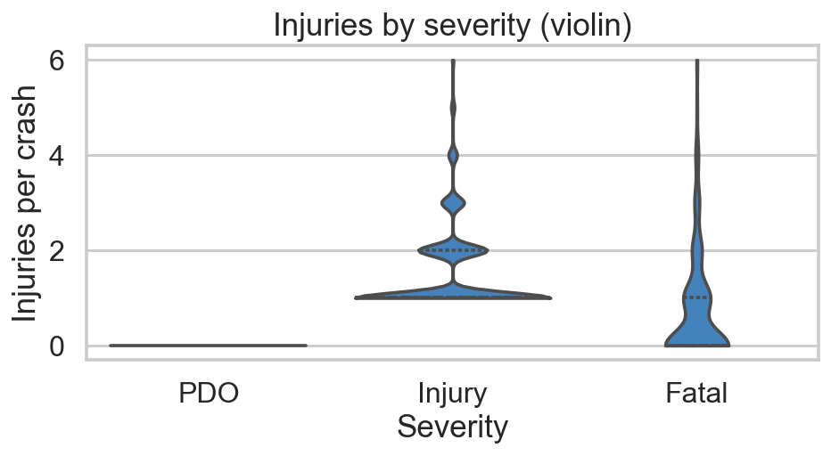
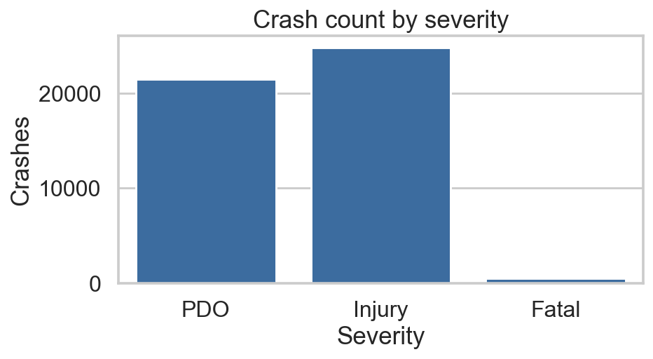
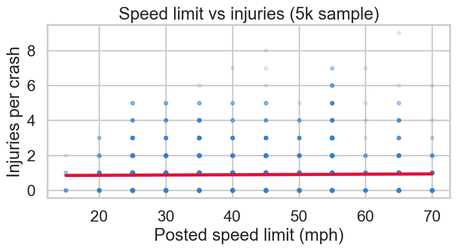
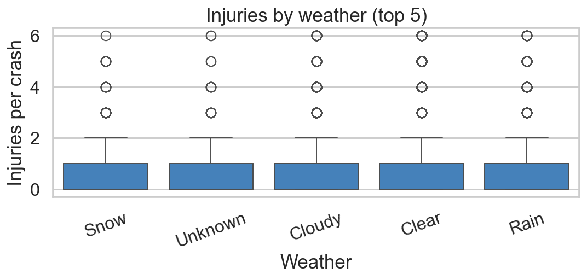
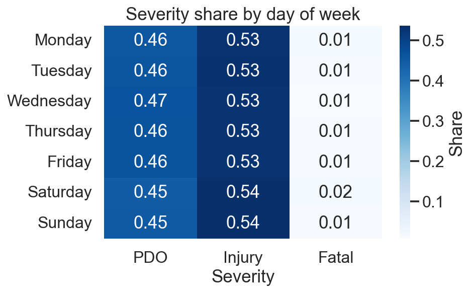
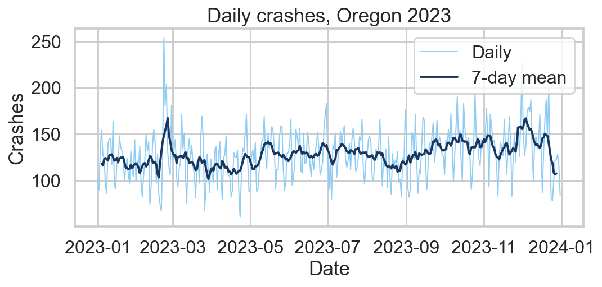
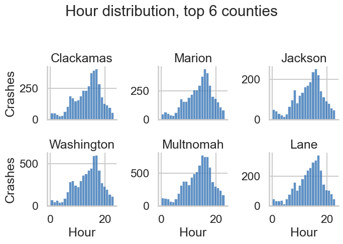

# Exploring and Visualizing Data

## USP 410/510 | Spring 2026

Dr. Liming Wang

Portland State University

<!--
Week 5 focus: EDA mindset and practical visualization with matplotlib/seaborn/plotly.
Tie examples back to ODOT crash data so students can reuse patterns for Assignment 1 and the final project.
-->

---
layout: section
---

# Part 1: What is EDA?

Based on Yu and Barter, *Veridical Data Science*, Chapter 5

---

# Today

- What EDA is and why it comes before modeling
- Question-driven exploration vs aimless plotting
- Common chart types and when each one fits
- Visualization grammar with `matplotlib`, `seaborn`, `plotly`
- Principles for honest, readable visualizations
- Live demo on ODOT crash data

---

# Core Idea

EDA is a **conversation with your data**

- Ask a question
- Make a summary or plot
- Update your mental model
- Ask the next question

<br>

> "EDA is detective work — your job is to interrogate the data before trusting it."
>
> — Yu and Barter

---

# Why EDA Before Modeling

- Surfaces data quality issues that cleaning missed
- Reveals distributions, outliers, and structural patterns
- Sharpens the research question
- Prevents fitting models to artifacts (sentinel values, encoding bugs)
- Generates hypotheses worth testing later

<br>

Skipping EDA = trusting numbers you have not looked at.

---

# Two Modes of EDA

| Mode | Purpose | Output |
| :--- | :--- | :--- |
| **Exploratory** | Generate hypotheses, find surprises | Many quick, rough plots |
| **Explanatory** | Communicate a finding | Few polished, labeled plots |

<br>

Most class plots start exploratory. Final report plots are explanatory.

Different modes — different polish budget.

---

# Question-Driven Exploration

Aimless plotting wastes time. Anchor each plot to a question.

- "How does crash count vary by hour of day?"
- "Are pedestrian crashes more concentrated on arterials?"
- "Did fatal crashes change after the speed limit reduction?"

<br>

Write the question above the cell. If the plot does not answer it, change the plot or change the question.

---

# What to Look At First

For every new dataset, run a short checklist:

- Shape, dtypes, missingness per column
- Distribution of each key numeric variable (histogram)
- Frequency of each key categorical variable (bar/value_counts)
- Pairwise relationships between key variables
- Time trends if there is a date column
- Spatial pattern if there is geometry

---
layout: section
---

# Part 2: Distributions and Summaries

---

# One Variable at a Time

Start univariate. Understand each column before combining them.

```python
df["CRASH_HR"].describe()
df["CRASH_HR"].value_counts().sort_index()
```

```python
import seaborn as sns
sns.histplot(df, x="CRASH_HR", bins=24)
sns.boxplot(df, x="CRASH_SVRTY")
```

<br>

Watch for spikes at sentinel values (`0`, `99`, `-1`) — those are usually missing-in-disguise.

---
layout: two-cols
---

# Histograms

Best for numeric distributions.

- Bin width changes the story — try a few
- Heavy tail? Consider log scale
- Bimodality? Two mixed populations
- Wall at zero? Measurement floor

```python
sns.histplot(df, x="HOUR", bins=24)
```

::right::

<div class="pl-4 pt-2 flex justify-center">
  
</div>

---
layout: two-cols
---

# Boxplots

Compact group summary — median, IQR, whiskers, outliers.

```python
sns.boxplot(df, x="SEV", y="TOT_INJ_CNT",
            order=["PDO", "Injury", "Fatal"])
```

<br>

Boxplot hides multimodality. Order matters — sort by median, not alphabetical.

::right::

<div class="pl-4 pt-2 flex justify-center">
  
</div>

---
layout: two-cols
---

# Violin Plots

Same as box plus density shape — reveals multimodality.

```python
sns.violinplot(df, x="SEV", y="TOT_INJ_CNT",
               inner="quartile")
```

<br>

Use `stripplot` / `swarmplot` for small `n` to show every point.

::right::

<div class="pl-4 pt-2 flex justify-center">
  
</div>

---
layout: two-cols
---

# Categorical Variables

Counts and proportions.

```python
df["SEV"].value_counts(normalize=True)
sns.countplot(df, x="SEV",
              order=["PDO", "Injury", "Fatal"])
```

- Order categories meaningfully
- Group tiny categories into "Other"
- Show proportions for unequal group sizes

::right::

<div class="pl-4 pt-2 flex justify-center">
  
</div>

---
layout: section
---

# Part 3: Relationships

---
layout: two-cols
---

# Two Numeric Variables

Scatter is the default. Add structure as needed.

```python
sns.regplot(
    df, x="POST_SPEED_LMT_VAL", y="TOT_INJ_CNT",
    scatter_kws={"alpha": 0.15},
)
```

- Use `alpha` for overplotting
- Add `lowess` / `regplot` smoother for trend
- `hexbin` or `kdeplot` for very dense scatter

::right::

<div class="pl-4 pt-2 flex justify-center">
  
</div>

---
layout: two-cols
---

# Numeric × Categorical

Compare distributions across groups.

```python
sns.boxplot(
    df, x="WTHR_COND_LONG_DESC", y="TOT_INJ_CNT",
    order=order_by_median,
)
```

<br>

Sort categories by median, not alphabetical. Reader sees the story faster.

::right::

<div class="pl-4 pt-2 flex justify-center">
  
</div>

---
layout: two-cols
---

# Two Categorical Variables

Cross-tabs and heatmaps.

```python
ct = pd.crosstab(df["DOW"], df["SEV"],
                 normalize="index")
sns.heatmap(ct, annot=True, fmt=".2f",
            cmap="Blues")
```

<br>

Normalize by row or column on purpose — choice changes what chart says.

::right::

<div class="pl-4 pt-2 flex justify-center">
  
</div>

---
layout: two-cols
---

# Time Series

Order matters. Use line plots, not scatter.

```python
daily = df.groupby(
    df["CRASH_DT"].dt.date
).size()
daily.plot()
daily.rolling(7, center=True).mean().plot()
```

- Aggregate to sensible grain (daily, weekly)
- Smooth with rolling means
- Mark known events with vertical lines

::right::

<div class="pl-4 pt-2 flex justify-center">
  
</div>

---
layout: two-cols
---

# Small Multiples

One chart per group — easier than overlaying many lines.

```python
g = sns.FacetGrid(df, col="CNTY_NM",
                  col_wrap=3, height=2.4)
g.map_dataframe(sns.histplot,
                x="HOUR", bins=24)
```

<br>

Same axes across panels = honest comparison.

::right::

<div class="pl-4 pt-2 flex justify-center">
  
</div>

---
layout: section
---

# Part 4: Visualization Tools in Python

Based on Turrell, Visualize chapter

---

# The Three Libraries You Will Use

| Library | Strength | When |
| :--- | :--- | :--- |
| `matplotlib` | Full control, foundation | Custom layouts, fine-tuning |
| `seaborn` | Concise statistical plots | Most EDA |
| `plotly` | Interactive, hover, zoom | Dashboards, web outputs |

<br>

Default to `seaborn` for EDA. Drop to `matplotlib` for polish. Use `plotly` for interactivity.

---

# matplotlib: Figure and Axes

Every plot lives inside a Figure with one or more Axes.

```python
import matplotlib.pyplot as plt

fig, ax = plt.subplots(figsize=(8, 4))
ax.hist(df["CRASH_HR"], bins=24)
ax.set_xlabel("Hour of day")
ax.set_ylabel("Crashes")
ax.set_title("Crash count by hour, Oregon 2023")
fig.tight_layout()
```

Knowing the Figure/Axes split unlocks every other plotting library.

---

# seaborn: Statistical Plots, Less Code

```python
import seaborn as sns

sns.set_theme(style="whitegrid")
sns.histplot(df, x="CRASH_HR", bins=24)
sns.relplot(df, x="speed_limit", y="num_injured",
            col="weather", kind="scatter", alpha=0.3)
```

- Built on matplotlib — anything seaborn returns can be tweaked with matplotlib
- Plays well with tidy long-format DataFrames
- `sns.set_theme()` once at top of notebook for consistent style

---

# plotly: Interactive in One Line

```python
import plotly.express as px

fig = px.scatter(df, x="speed_limit", y="num_injured",
                 color="weather", hover_data=["CRASH_ID"])
fig.show()
```

- Hover, zoom, pan, toggle legend
- Exports to standalone HTML — useful for Assignment 2
- Heavy for very large datasets — sample first

---

# seaborn vs plotly: When to Use Each

<div class="grid grid-cols-2 gap-6 pt-2">

<div>

### `seaborn` excels at

- Fast statistical EDA (one-line plots)
- Group comparisons: box, violin, strip
- Faceting via `relplot` / `catplot` / `FacetGrid`
- Distribution diagnostics (`kdeplot`, `pairplot`)
- Print/PDF outputs — clean static figures
- Tight integration with matplotlib for polish

**Use when**: writing a notebook, a report, or a paper.

</div>

<div>

### `plotly` excels at

- Interactive hover, zoom, pan, legend toggle
- Linked views and animation (`animation_frame`)
- Maps (`scatter_map`, `choropleth_map`)
- Standalone HTML export — share without Python
- Embed in Streamlit / Quarto dashboards
- 3D and large coordinate spaces

**Use when**: audience explores data themselves.

</div>

</div>

<br>

Default: `seaborn` for analysis, `plotly` for delivery. Assignment 2 needs interactivity → `plotly`.

---

# Plotly for Maps (Preview)

```python
fig = px.scatter_map(
    df.dropna(subset=["LAT", "LON"]),
    lat="LAT", lon="LON",
    color="CRASH_SVRTY",
    zoom=10,
)
fig.show()
```

<br>

Spatial visualization gets its own week (Week 7). For now, treat lat/lon as just two more numeric columns.

---
layout: section
---

# Part 5: Principles for Honest Plots

---

# Five Rules of Thumb

1. **Label everything** — title, axes with units, legend
2. **Choose the right chart** — match the variable type
3. **Show the data** — avoid hiding raw values behind heavy summaries
4. **Use color with intent** — encode a variable, not decoration
5. **Reduce ink** — remove gridlines, borders, 3D effects that do not inform

---

# Color, Briefly

Color encodes meaning. Pick palettes that match the variable.

| Variable type | Palette | Examples |
| :--- | :--- | :--- |
| Categorical (unordered) | Qualitative | `tab10`, `Set2` |
| Ordered / sequential | Sequential | `Blues`, `viridis` |
| Diverging around a midpoint | Diverging | `RdBu`, `coolwarm` |

<br>

Avoid rainbow (`jet`) for continuous data — it lies about magnitude and fails for color-blind readers.

---

# Common Mistakes

- Truncated y-axis that exaggerates differences
- Pie charts with too many slices
- Dual y-axes that imply false correlation
- Bar chart of means without showing variability
- Maps with raw counts instead of rates (population matters)

<br>

If a plot can mislead a reader, it will.

---

# When a Table Beats a Chart

- Exact numbers matter (counts, rates for a report)
- Few rows, few columns
- Audience needs to look up specific values

<br>

Not every comparison needs a chart. A clean `groupby().agg()` table is often the better answer.

---
layout: section
---

# Part 6: Live Demo — ODOT Crashes

---

# Hands-on Notebook

All of today's demo code is in the companion notebook:

### [week5_eda_demo.ipynb](week5_eda_demo.ipynb)

1. Univariate sweep — histograms, value counts
2. Time of day and day of week patterns
3. Severity by weather and surface conditions
4. Speed limit vs injuries scatter
5. One polished chart for the "report"
6. Export interactive plotly map to HTML

<br>

EDA loop: `question → group/filter → plot → read it → next question`

Keep cells short. Polish only the few that earn it.

---

# In-Class Exercise (10–15 min)

Pick one column from the crash data and answer:

1. What is its distribution?
2. Is anything surprising or wrong-looking?
3. How does it relate to one other column you choose?
4. Make one explanatory chart with full labels and a clear title.

<br>

Pair up. Compare what each of you found surprising.

---

# Key Takeaways

- EDA is question-driven detective work, not decoration
- Inspect distributions before relationships
- Match chart type to variable type
- `seaborn` for fast EDA, `matplotlib` for polish, `plotly` for interactivity
- Label, color, and scale honestly
- A few good plots beat many sloppy ones

---
layout: center
---

# For Next Week

<div class="text-left">

**Week 6 topic (Thursday, May 7, 2026):** Reproducible research; Quarto and Jupyter Notebooks

**Read:**
- Turrell, [Quarto for Python](https://aeturrell.github.io/python4DS/quarto.html)
- [Quarto + Jupyter quickstart](https://quarto.org/docs/get-started/hello/jupyter.html)

**Due Thursday, May 7, 2026:**
- **Project proposal** (1 page) — W6
- **Assignment 2** assigned — Interactive Crash Map

**Due Thursday, May 14, 2026:**
- DataCamp DC3: [Intro to Data Visualization with Seaborn](https://www.datacamp.com/courses/introduction-to-data-visualization-with-seaborn)

**Week 5 sources:**
- Yu and Barter, [Chapter 5: Exploratory Data Analysis](https://vdsbook.com/05-eda)
- Turrell, [Visualize chapter](https://aeturrell.github.io/python4DS/visualise.html)

</div>
