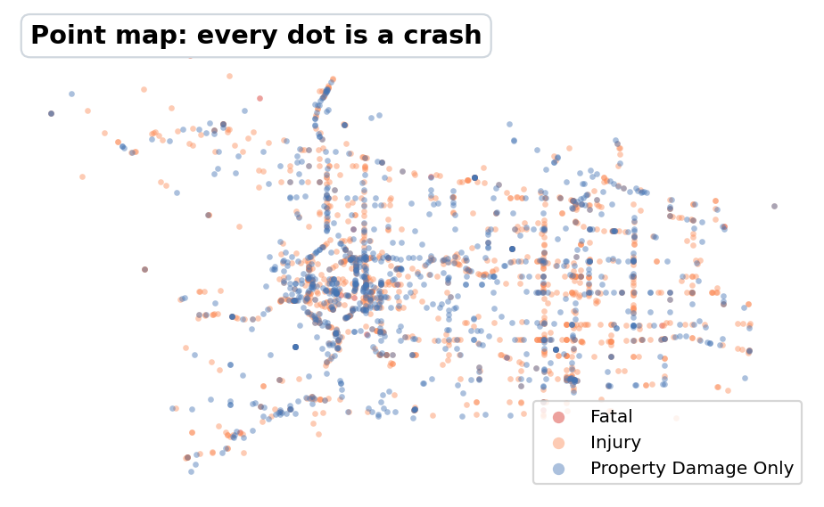
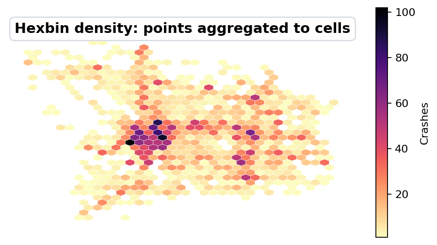
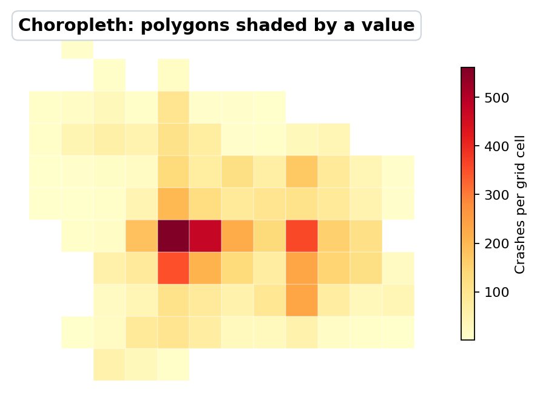
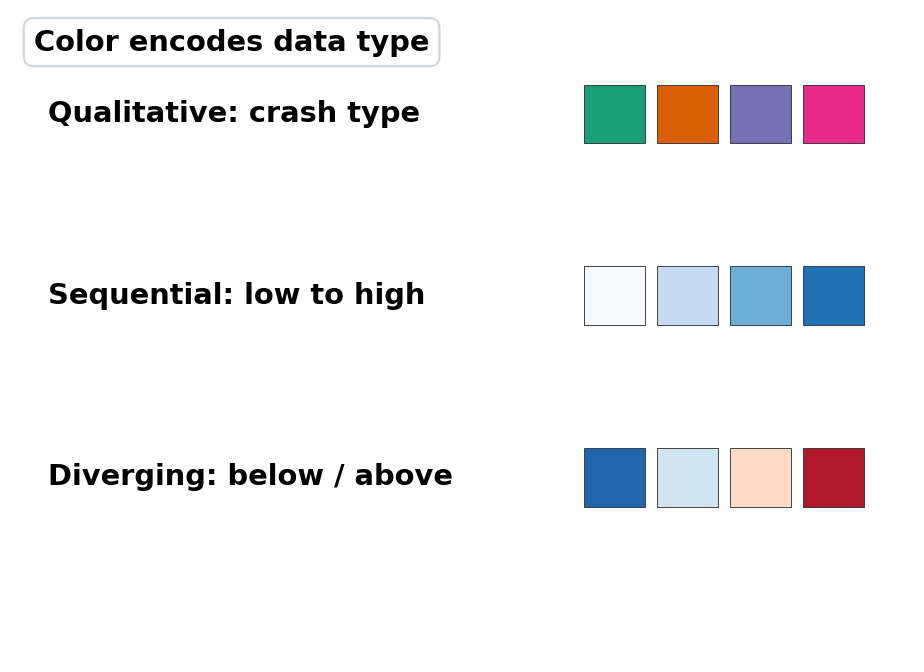
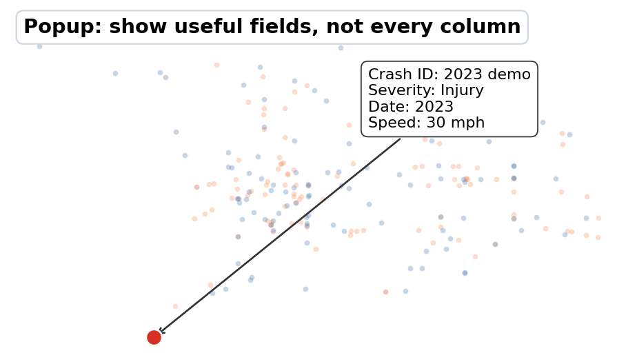
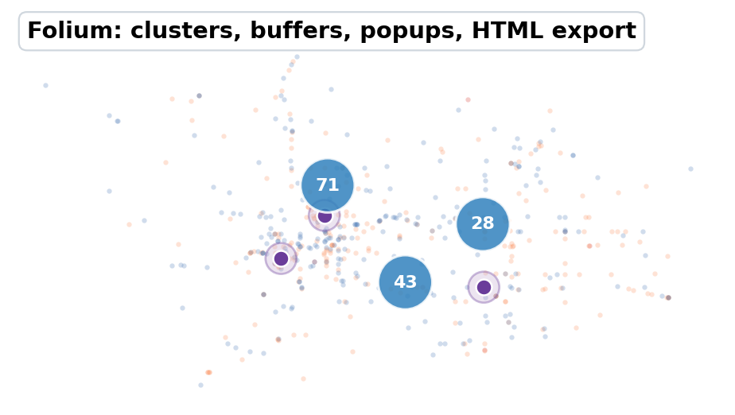
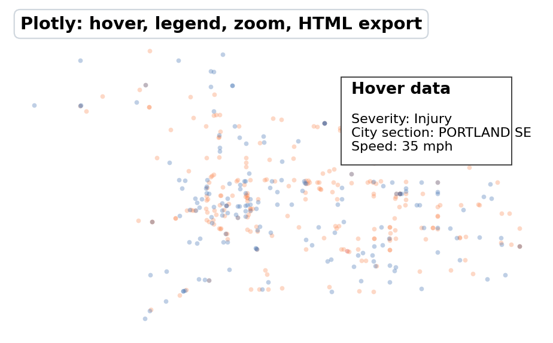
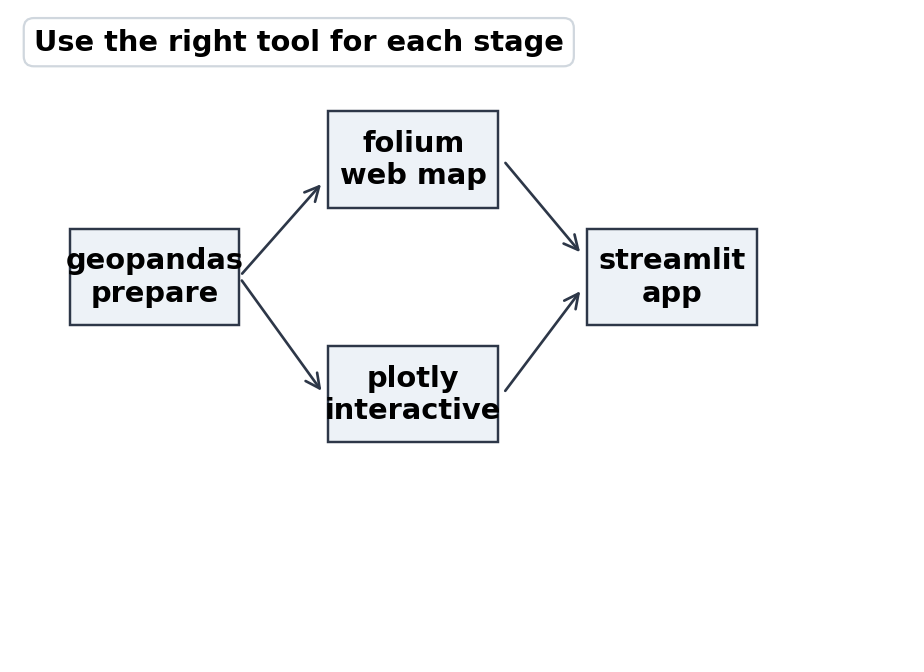
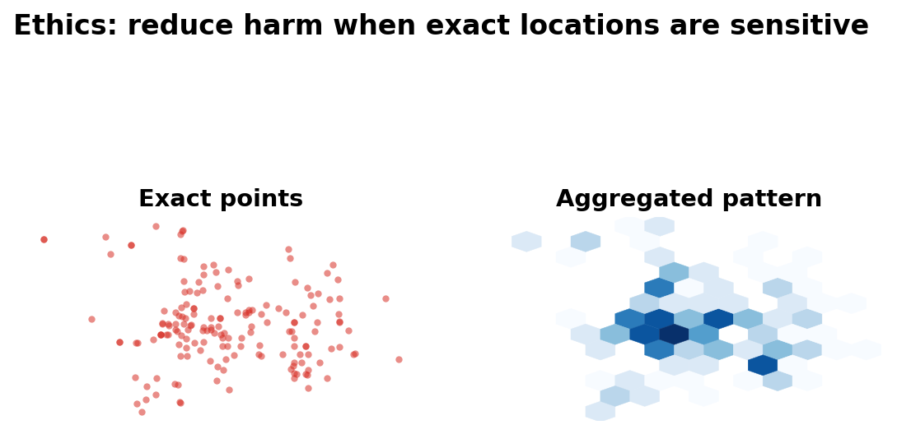

# Working with Spatial Data and Maps

## USP 410/510 | Spring 2026

Dr. Liming Wang

Portland State University

<!--
Week 7 focus: spatial data thinking, GeoDataFrames, projections, spatial joins,
interactive maps, and Assignment 2 design choices.
-->

---
layout: section
---

# Part 1: Geographic Thinking

Based on Rey, Arribas-Bel, and Wolf, *Geographic Data Science with Python*, Chapters 1-4

---

# Today

- Why spatial data is more than coordinates on a map
- Geographic data models: objects, fields, networks
- Spatial data structures in Python
- `geopandas` and `GeoDataFrame` basics
- Coordinate reference systems and distance
- Spatial joins, buffers, and aggregation
- Interactive maps for Assignment 2
- Companion notebook: [week7_maps_demo.ipynb](week7_maps_demo.ipynb)

---

# Week 7 Logistics

Today is Thursday, May 14, 2026.

<br>

**Due today:**
- DataCamp DC3: Intro to Data Visualization with Seaborn

**Assigned today:**
- DataCamp DC4: Working with Geospatial Data in Python

**Due next week:**
- Assignment 2: Interactive Crash Map
- Project progress update

---

# Core Claim

Spatial data adds a fifth link to our reproducible chain:

1. **Question**
2. **Data**
3. **Geography**
4. **Code**
5. **Claim**

<br>

Location is not just another column. It changes what observations mean because it creates relationships between them.

---

# Why This Matters in Urban Data Science

Many urban questions are spatial by default:

- Which streets are dangerous for pedestrians?
- Who lives near frequent transit?
- Where is heat exposure high and tree canopy low?
- Which neighborhoods are far from parks, clinics, or grocery stores?
- Where should a city prioritize limited infrastructure funds?

<br>

A map can clarify these questions, but it can also hide bad assumptions.

---

# The First Geographic Question

Before opening `geopandas`, ask:

> What is the spatial unit of analysis?

<br>

Examples:

- A crash point?
- A street segment?
- A school attendance zone?
- A census tract?
- A 400-meter buffer?
- A transit stop catchment?

<br>

Changing the unit can change the answer.

---

# Three Geographic Data Models

| Model | What it represents | Urban example |
| :--- | :--- | :--- |
| **Objects** | Discrete things with boundaries or locations | Parcels, crashes, schools, census tracts |
| **Fields** | Continuous surfaces measured across space | Temperature, elevation, air pollution |
| **Networks** | Connected systems and flows | Streets, transit routes, pipes, bike networks |

<br>

The model is conceptual. The file format is secondary.

---

# Objects

Objects are bounded or located entities.

| Geometry | Example | Typical question |
| :--- | :--- | :--- |
| Point | Crash, tree, bus stop | What is nearby? |
| Line | Street, sidewalk, transit route | What corridor is affected? |
| Polygon | Parcel, tract, school zone | What is inside? |

<br>

Most Assignment 2 projects will start with object data: crash points plus boundaries, corridors, or buffers.

---

# Fields

Fields represent values that vary continuously over space.

- Heat exposure
- Elevation
- Air pollution
- Noise
- Flood depth
- Tree canopy probability

<br>

Computers usually store fields as rasters: grids of cells, each with a value.

Important question: does the grid represent a measured surface, a modeled estimate, or a convenient approximation?

---

# Networks

Networks represent connections, not just locations.

- Streets connect intersections
- Transit lines connect stops
- Sidewalks connect origins and destinations
- Freight routes connect producers, warehouses, and customers

<br>

Straight-line distance can be misleading when the real relationship is network travel time or connectivity.

---

# Model vs Data Structure

| Conceptual model | Common data structure | Python libraries |
| :--- | :--- | :--- |
| Objects | Geographic table | `geopandas`, `shapely` |
| Fields | Raster / array / data cube | `rioxarray`, `xarray`, `rasterio` |
| Networks | Graph / weights matrix | `osmnx`, `networkx`, `libpysal` |

<br>

For this week, we focus mostly on geographic tables because they are the easiest bridge from `pandas`.

---

# Geographic Thinking Checklist

For any map or spatial analysis:

- What is the unit of observation?
- What geometry represents that unit?
- What coordinate system is being used?
- Are we counting, measuring, or estimating?
- What spatial relationship matters: within, near, adjacent, connected?
- What scale is appropriate for the claim?

<br>

If these are unclear, the map is not ready to be trusted.

---
layout: section
---

# Part 2: Spatial Data in Python

---

# The Main Idea

A `GeoDataFrame` is a `pandas` DataFrame with a special geometry column.

```python
import geopandas as gpd

tracts = gpd.read_file("data/census_tracts.geojson")
tracts.head()
```

<br>

You still get familiar DataFrame operations:

```python
tracts[["GEOID", "population", "geometry"]]
tracts.query("population > 1000")
tracts.groupby("county").size()
```

The difference is that `geometry` lets Python understand space.

---

# Common Spatial File Types

| Format | Typical use | Notes |
| :--- | :--- | :--- |
| GeoPackage (`.gpkg`) | Vector layers | Modern, one file, multiple layers |
| GeoJSON (`.geojson`) | Web maps, small data | Human-readable, can get large |
| Shapefile (`.shp`) | Legacy GIS | Multiple files, field name limits |
| File geodatabase (`.gdb`) | Esri/agency data | Folder-like database |
| GeoTIFF (`.tif`) | Raster surfaces | Imagery, elevation, gridded data |
| CSV with lat/lon | Point data | Needs conversion to geometry |

<br>

Read with a spatial library, then work with the data structure.

---

# From CSV to Points

ODOT-style point data often starts as a regular table with latitude and longitude columns.

```python
import pandas as pd
import geopandas as gpd

crashes = pd.read_csv("data/crashes.csv")

valid = crashes.dropna(subset=["LAT", "LON"]).copy()

crash_points = gpd.GeoDataFrame(
    valid,
    geometry=gpd.points_from_xy(valid["LON"], valid["LAT"]),
    crs="EPSG:4326",
)
```

<br>

Longitude is x. Latitude is y.

---

# Geometry Types

`shapely` stores the actual geometry objects inside a `GeoDataFrame`.

```python
crash_points.geometry.geom_type.value_counts()
```

| Type | Dimension | Example |
| :--- | :--- | :--- |
| `Point` | 0D | Crash location |
| `LineString` | 1D | Street centerline |
| `Polygon` | 2D | Census tract |
| `MultiPolygon` | 2D collection | City boundary with islands |

<br>

The geometry type should match the question.

---

# Coordinate Reference Systems

Coordinates only make sense with a coordinate reference system, or CRS.

```python
crash_points.crs
```

Common examples:

| CRS | Common use | Be careful |
| :--- | :--- | :--- |
| `EPSG:4326` | Latitude/longitude | Good for storage, not distance |
| `EPSG:3857` | Web basemaps | Good for web maps, distorted area |
| Local projected CRS | Distance/area | Best for buffers, lengths, area |

<br>

If the CRS is missing or wrong, every spatial operation downstream is suspect.

---

# Reproject Before Measuring

Do not buffer or measure distance in latitude/longitude degrees.

```python
# Good default: estimate a local UTM CRS from the data
local_crs = crash_points.estimate_utm_crs()
crash_points_m = crash_points.to_crs(local_crs)

crash_points_m["buffer_400m"] = crash_points_m.geometry.buffer(400)
```

<br>

Degrees are angles. Meters are distances.

Use `to_crs()` when the operation depends on distance or area.

---

# Quick Static Map

```python
ax = crash_points.plot(
    markersize=2,
    alpha=0.25,
    color="crimson",
    figsize=(8, 8),
)
ax.set_axis_off()
```

<br>

This is enough for a first check:

- Are points in the expected place?
- Are there obvious outliers?
- Is latitude/longitude reversed?
- Are missing or zero coordinates showing up?

---

# Add a Basemap

`contextily` adds web tiles behind projected data.

```python
import contextily as cx

crashes_web = crash_points.to_crs(epsg=3857)

ax = crashes_web.plot(
    markersize=3,
    alpha=0.35,
    color="crimson",
    figsize=(8, 8),
)
cx.add_basemap(ax, source=cx.providers.CartoDB.Positron)
ax.set_axis_off()
```

<br>

Use basemaps for context, not decoration. They should help the reader interpret location.

---

# Attribute Join vs Spatial Join

| Join type | Relationship | Example |
| :--- | :--- | :--- |
| Attribute join | Same key value | Join tract data by `GEOID` |
| Spatial join | Geometric relationship | Assign each crash to a tract |

<br>

```python
crashes_in_tracts = gpd.sjoin(
    crash_points,
    tracts[["GEOID", "geometry"]],
    how="left",
    predicate="within",
)
```

Spatial joins answer questions like "which polygon contains this point?"

---

# Spatial Predicates

Common spatial relationships:

| Predicate | Meaning | Example question |
| :--- | :--- | :--- |
| `within` | A is inside B | Which tract contains this crash? |
| `contains` | A contains B | Which park contains this tree? |
| `intersects` | A touches or overlaps B | Which corridors cross flood zones? |
| `nearest` | Closest feature | Which bus stop is nearest? |

<br>

The predicate is part of your method. Choose it deliberately.

---

# Buffers

Buffers create areas within a distance of a feature.

```python
schools_m = schools.to_crs(local_crs)
crashes_m = crash_points.to_crs(local_crs)

school_buffers = schools_m.copy()
school_buffers["geometry"] = schools_m.geometry.buffer(400)

crashes_near_schools = gpd.sjoin(
    crashes_m,
    school_buffers[["school_name", "geometry"]],
    how="inner",
    predicate="within",
)
```

<br>

A 400-meter buffer is a model of access or exposure, not the same thing as a real walking route.

---

# Aggregating Points to Areas

After a spatial join, use normal `pandas` tools.

```python
crashes_by_tract = (
    crashes_in_tracts
    .groupby("GEOID")
    .agg(
        crashes=("CRASH_ID", "count"),
        severe_crashes=("severe", "sum"),
    )
    .reset_index()
)

tract_map = tracts.merge(crashes_by_tract, on="GEOID", how="left")
```

<br>

This is the bridge from point data to choropleth maps or area summaries.

---

# Counts vs Rates

Raw counts are often misleading.

| Measure | What it shows | Risk |
| :--- | :--- | :--- |
| Crash count | Where more crashes occurred | Rewards bigger areas and busier roads |
| Crash rate per resident | Resident exposure | Weak for commuter corridors |
| Crash rate per road mile | Corridor density | Ignores traffic volume |
| Crash rate per vehicle mile | Exposure-adjusted risk | Data can be hard to get |

<br>

The denominator is part of the argument.

---

# The Scale Problem

Spatial results can change when you change:

- Boundary definitions
- Grid size
- Buffer distance
- Time window
- Aggregation level
- The denominator used for rates

<br>

This is why "the map shows..." is too weak. Say what geography, scale, and measure the map shows.

---
layout: section
---

# Part 3: Making Useful Maps

---

# A Map Is an Argument

A strong map makes a claim visible.

Weak:

> Here are all crash points in Oregon.

Stronger:

> Severe pedestrian crashes are concentrated along a small set of East Portland corridors after dark.

<br>

The map should have a question, audience, and decision context.

---

# Map Design Choices

| Choice | Ask yourself |
| :--- | :--- |
| Extent | What geographic area should be visible? |
| Layer | What data belongs on the map? |
| Symbol | Point, line, polygon, heatmap, label? |
| Color | What variable does color encode? |
| Classification | How are values grouped? |
| Interaction | What should users hover, filter, or click? |

<br>

Every visual choice should support interpretation.

---
layout: two-cols
---

# Point Maps

Point maps work well when:

- Locations are meaningful individually
- The number of points is manageable
- Overplotting is not severe
- Popups add useful detail

<br>

Point maps fail when:

- Dense areas turn into unreadable clusters
- Exact location creates privacy risk
- The real question is about rates or patterns

::right::

<div class="pl-4 pt-2 flex justify-center">
  
</div>

---
layout: two-cols
---

# Density and Hotspot Maps

Use aggregation or density when individual points overwhelm the map.

Options:

- Hex bins or square grids
- Counts by census tract or neighborhood
- Kernel density or heatmap
- Corridor-level summaries
- Clustered markers for exploratory browsing

<br>

Aggregation makes patterns visible, but it also chooses a scale.

::right::

<div class="pl-4 pt-2 flex justify-center">
  
</div>

---
layout: two-cols
---

# Choropleth Maps

Choropleths shade polygons by a value.

| Use for | Be careful with |
| :--- | :--- |
| Rates and percentages | Raw counts |
| Index values | Unequal polygon sizes |
| Area summaries | Tiny sample sizes |
| Comparing places | Boundaries that imply false precision |

Crash-map question: are tract boundaries meaningful for the process?

::right::

<div class="pl-4 pt-2 flex justify-center">
  
</div>

---
layout: two-cols
---

# Color for Maps

| Data type | Palette type | Example |
| :--- | :--- | :--- |
| Unordered categories | Qualitative | Crash type |
| Low to high values | Sequential | Crash rate |
| Above/below reference | Diverging | Change from city average |

<br>

Use basemap colors quietly. The thematic layer should carry the meaning.

::right::

<div class="pl-4 pt-2 flex justify-center">
  
</div>

---
layout: two-cols
---

# Popups and Tooltips

Interactivity should answer likely reader questions.

Useful popup fields:

- Date or time period
- Severity or category
- Street or corridor name
- Summary counts and rates
- Source and update date

Avoid:

- Every raw column
- Codes without labels
- Personal or sensitive information
- Popups that repeat what the color already shows

::right::

<div class="pl-4 pt-2 flex justify-center">
  
</div>

---
layout: two-cols
---

# Folium Demo in Notebook

Companion notebook:

### [week7_maps_demo.ipynb](week7_maps_demo.ipynb)

The Folium demo shows how to:

- Load ODOT crash points from the geodatabase
- Reproject data for web mapping
- Filter to Portland-area records
- Add marker clusters and popups
- Add 400-meter demo buffers
- Export a standalone HTML map

::right::

<div class="pl-4 pt-2 flex justify-center">
  
</div>

---
layout: two-cols
---

# Plotly Demo in Notebook

Companion notebook:

### [week7_maps_demo.ipynb](week7_maps_demo.ipynb)

The Plotly demo shows how to:

- Use latitude/longitude columns from a `GeoDataFrame`
- Style points by crash severity
- Control hover fields
- Set map center, zoom, and height
- Export a shareable HTML file

<br>

Plotly is often the fastest path from DataFrame to interactive map.

::right::

<div class="pl-4 pt-2 flex justify-center">
  
</div>

---
layout: two-cols
---

# When to Use Each Tool

| Tool | Best for | Watch out |
| :--- | :--- | :--- |
| `geopandas` | Spatial cleaning, joins, projections | Not a dashboard tool |
| `contextily` | Static basemap context | Needs web mercator |
| `folium` | Leaflet-style web maps | Many points can be slow |
| `plotly` | Fast interactive charts and maps | Browser performance limits |
| `streamlit` | Simple map apps with controls | Needs app deployment |

<br>

Use `geopandas` for preparation even if final delivery uses another tool.

::right::

<div class="pl-4 pt-2 flex justify-center">
  
</div>

---
layout: two-cols
---

# Map Ethics

Spatial data can expose people and communities.

- Avoid publishing exact locations for sensitive events
- Aggregate or jitter when individual points create risk
- Explain uncertainty and missingness
- Do not imply causation from proximity alone
- Consider who benefits or is burdened by the map

<br>

Urban maps are often interpreted as evidence. Treat that evidence carefully.

::right::

<div class="pl-4 pt-2 flex justify-center">
  
</div>

---
layout: section
---

# Part 5: Assignment 2 Workshop

---

# Assignment 2 Status

Assigned: Thursday, May 7, 2026

Due: Thursday, May 21, 2026

<br>

Task: create an interactive crash map with a point of view.

- Use ODOT crash data
- Choose a specific audience or decision context
- Use `folium`, `plotly`, `streamlit`, or similar
- Export/deploy as HTML or a web app
- Include a short explanation and AI use statement

---

# Good A2 Map Questions

Strong map questions usually specify:

1. **Place**: Portland, East Portland, school areas, a corridor
2. **Population or mode**: pedestrians, cyclists, all crashes
3. **Severity or outcome**: fatal, serious injury, total crashes
4. **Time**: year, season, nighttime, before/after
5. **Action context**: prioritize, compare, screen, monitor

<br>

If the question has no audience or decision, the map will drift toward data browsing.

---

# Example Directions

| Question | Spatial move |
| :--- | :--- |
| Which school areas have severe crashes nearby? | School buffers + point counts |
| Which corridors have nighttime pedestrian crashes? | Filter points + line/corridor summary |
| Are crashes concentrated near high-speed roads? | Join/nearest road attributes |
| Which neighborhoods have high crash rates? | Point-in-polygon + denominator |
| Where should PBOT inspect first? | Rank areas or corridors by chosen metric |

<br>

Start with one clean spatial move. Add complexity only if it helps the argument.

---

# A2 Workflow

1. State the map question
2. Load and clean crash records
3. Convert to a `GeoDataFrame`
4. Filter by place, year, severity, or mode
5. Add spatial context: boundaries, roads, schools, buffers
6. Summarize or style the map layer
7. Export or deploy
8. Write explanation, limitations, and AI use statement

<br>

Keep each step visible in the notebook or script.

---

# Minimum Technical Checklist

Your map should have:

- Correct latitude/longitude handling
- A clear title or heading in the output
- Legend or labels for colors
- Useful hover/popup information
- Reasonable initial zoom and extent
- No irrelevant raw columns exposed to users
- Exported HTML or deployable app
- Source code that can be rerun

---

# Interpretation Checklist

Your submission should explain:

- What question the map answers
- What data source and time period it uses
- What filters or spatial operations you applied
- What pattern the viewer should notice
- What the map cannot prove
- What you would do next with more time or data

<br>

The written explanation is part of the data product.

---

# In-Class Exercise

Pick one Assignment 2 idea and fill this in:

| Prompt | Your answer |
| :--- | :--- |
| Audience | |
| Decision | |
| Geography | |
| Crash subset | |
| Spatial operation | |
| Map type | |
| Main limitation | |

<br>

Pair up and test whether the map question is specific enough to build.

---

# Key Takeaways

- Spatial data requires geographic thinking, not just mapping software
- Choose the unit of analysis before choosing the tool
- CRS matters whenever distance, area, or basemaps are involved
- Spatial joins connect point events to places
- Interactive maps need a point of view, not just points

---
layout: center
---

# Week 7 Sources

<div class="text-left text-sm leading-snug max-w-4xl">

- Rey, Arribas-Bel, and Wolf, [Geographic Thinking for Data Scientists](https://geographicdata.science/book/notebooks/01_geo_thinking.html)
- Rey, Arribas-Bel, and Wolf, [Computational Tools for Geographic Data Science](https://geographicdata.science/book/notebooks/02_geospatial_computational_environment.html)
- Rey, Arribas-Bel, and Wolf, [Spatial Data](https://geographicdata.science/book/notebooks/03_spatial_data.html)

</div>

---
layout: center
---

# For Next Week

<div class="text-left max-w-3xl">

**Week 8 topic:** Accessing public data from the web and via APIs

**Read:**
- [censusdis documentation](https://censusdis.readthedocs.io/)
- [Web Scraping with BeautifulSoup](https://realpython.com/beautiful-soup-web-scraper-python/)

**Due Thursday, May 21, 2026:**
- Assignment 2: Interactive Crash Map
- Project progress update

**Assigned this week:**
- DataCamp DC4: [Working with Geospatial Data in Python](https://www.datacamp.com/courses/working-with-geospatial-data-in-python), due Thursday, May 28, 2026

</div>
